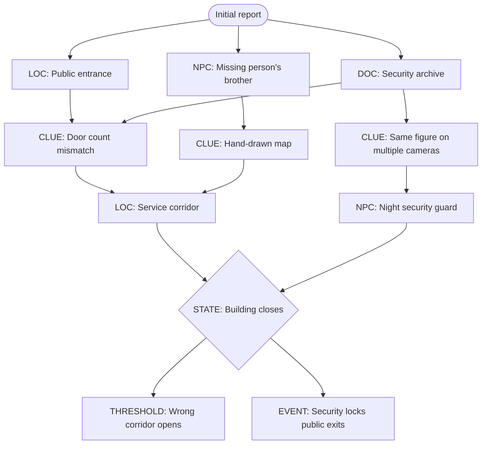

# Off the Record: TTRPG Module Writing Skill

## Purpose

Write **playable investigative tabletop modules**, not short stories, lore catalogues, videogame quest chains, or collections of atmospheric locations.

An *Off the Record* module should feel like a strange file passed across the desk of an independent newsroom or research team in an alternate-universe 1970s: local, physical, bureaucratic, human, slightly shabby, and increasingly difficult to explain.

The module must give the GM enough structure to create momentum without prescribing what the players do. The players investigate. The world reacts. Evidence accumulates. Pressure rises. The situation changes.

The central design question is never:

> "What scene happens next?"

It is:

> **"What is happening here, what can the investigators discover, and what changes if they interfere, delay, misunderstand, or push too far?"**

---

# 1. Series Identity

## 1.1 What Off the Record Is

*Off the Record* is a modern paranormal investigative TTRPG series presented through the visual and narrative language of a parallel-universe 1970s newsroom, independent research desk, civic archive, or local investigative bureau.

Typical ingredients include:

- real or plausibly real places
- mundane institutions rubbing against impossible events
- local history, civic infrastructure, records, maps, signage, maintenance spaces, basements, service corridors, terminals, parks, malls, stations, motels, offices, archives, warehouses, and overlooked public architecture
- witnesses who saw only one piece
- records that almost agree
- documents written by people who do not realize they are documenting the supernatural
- wrong dates, wrong maps, impossible continuities, duplicated rooms, vanished structures, misfiled identities, repeating broadcasts, anomalous photographs, contradictory testimony
- a mystery that begins as a discrepancy and becomes a situation
- humor, bureaucracy, ordinary human concerns, and inconvenience existing beside genuine dread

The paranormal should usually enter through a **crack in the ordinary**, not by arriving already labeled as a monster, curse, portal, haunting, or cosmic phenomenon.

## 1.2 Tonal Target

Aim for:

- documentary unease
- local specificity
- investigative curiosity
- dry institutional absurdity
- human warmth amid strangeness
- mounting pressure
- incomplete but actionable truth
- occasional frightening or surreal escalation
- the feeling that somebody filed this under the wrong heading thirty years ago

Avoid defaulting to:

- generic creepypasta
- "spooky abandoned place" without a situation
- lore for lore's sake
- endless cryptic fragments that never become useful
- cosmic-horror vagueness as a substitute for design
- quippy blockbuster dialogue
- grimness without ordinary life
- elaborate mythology that never affects play

---

# 2. The Prime Directive: Build a Situation, Not a Plot

A module is not a sequence of scenes the players are expected to perform.

A module is a **loaded situation** containing:

1. a disturbance
2. people who want incompatible things
3. evidence that can be found in multiple ways
4. places where evidence, danger, and people intersect
5. an underlying truth or model that explains enough of the disturbance to run it
6. pressures that continue whether or not the investigators act
7. one or more thresholds after which the situation becomes harder, stranger, more public, or more dangerous
8. multiple plausible forms of intervention
9. consequences that reflect what the investigators actually did

The GM should be able to answer, at any point:

- What is happening right now?
- Who wants what?
- What does this place contain?
- What clues are available here?
- What happens if the investigators do nothing?
- What changes because of what they just did?

If the module cannot answer these, more prose will not fix it. The scenario engine is missing.

---

# 3. The Minimum-Invention Rule

This rule is especially important when revising an existing *Off the Record* module.

## 3.1 Use What Already Exists First

Before inventing a new node, NPC, faction, document, supernatural rule, or location:

1. inventory the existing material
2. identify what function is missing
3. check whether an existing element can perform that function
4. connect existing elements before adding new ones

**Prefer connective tissue over expansion.**

If a draft contains eleven interesting paranormal locations but no escalation, do **not** solve the problem by adding location twelve.

Instead, ask:

- Which existing location can foreshadow another?
- Which NPC moves between two nodes?
- Which clue changes meaning after a later discovery?
- Which phenomenon spreads?
- Which authority begins interfering?
- Which location becomes unavailable?
- What happens at a specific time?
- What reacts to investigation?

## 3.2 When New Material Is Necessary

Add the smallest useful piece.

Good additions:

- one witness who connects two existing places
- a maintenance log that explains how to reach a hidden service area
- a clock event that forces movement
- a recurring physical anomaly that reveals the same rule in different contexts
- a single antagonist action connecting previously isolated nodes

Weak additions:

- a new faction with its own lore
- three more spooky locations
- an unrelated side mystery
- a new cosmology because the existing mystery feels thin
- an NPC whose only purpose is exposition

When adding significant new canon to an existing scenario, clearly mark it as **new connective material** until approved.

---

# 4. The Scenario Spine

Every module needs a spine. The spine is not a railroad. It is the logic that keeps the scenario coherent no matter where players wander.

Define these before drafting full prose.

## 4.1 The Disturbance

State the initial wrongness in one or two sentences.

Examples of disturbance shapes:

- A public place contains an entrance that employees insist does not exist.
- Archived records disagree about a building's location, but both sets appear physically correct.
- Security footage shows the same person entering through three different doors at the same minute.
- A transit map preserves a station that was never built, and commuters are beginning to arrive from it.
- A missing person's photographs show spaces the investigators can now physically enter.

The disturbance should produce questions naturally.

## 4.2 The Hidden Situation

Write the GM truth plainly.

Include:

- what is actually happening
- why it is happening now
- what rules govern it
- who knows part of the truth
- who caused or benefits from it, if anyone
- what it wants, if "want" applies
- what happens if nobody intervenes

The GM truth may contain uncertainty, but uncertainty must be **intentional**.

Do not hide essential information from the GM for dramatic effect.

## 4.3 The Human Situation

The supernatural disturbance should intersect with ordinary motives.

At minimum, identify:

- one person trying to conceal something
- one person trying to understand something
- one person whose mundane priority conflicts with the investigation
- one person who has misunderstood the phenomenon in an interesting way

These can overlap.

Human motives create friction without requiring a villain.

### Load-Bearing Cast

Every significant NPC should carry weight in the scenario.

Ask:

> If this NPC vanished from the manuscript, what piece of pressure, information, moral tension, access, or consequence would disappear with them?

If the answer is "not much," combine them with another NPC or cut them.

A strong NPC may carry:

- one piece of the central cost
- one perspective nobody else has
- one practical form of access
- one social complication
- one future action that changes the situation

Not every NPC needs all five. Every important NPC needs a job.

## 4.4 The Escalation

Write 3–6 state changes.

Example structure:

1. **Oddity** — evidence is deniable; investigators can move freely.
2. **Recurrence** — the anomaly repeats or appears somewhere new.
3. **Interference** — an institution, witness, rival, security force, or phenomenon reacts.
4. **Loss** — a person, route, record, or safe assumption becomes unavailable.
5. **Exposure** — the phenomenon becomes public, dangerous, contagious, or impossible to dismiss.
6. **Break** — reality, institutional control, or the local situation can no longer return to baseline without intervention.

Escalation should change play, not just add spooky description.

---

# 5. Investigation Architecture: Point-Crawl, Not Cutscene Chain

## 5.1 Nodes

A node is any location, person, archive, event, or evidence cluster where investigators can obtain meaningful information or alter the situation.

Common node types:

- physical location
- witness or NPC
- archive / records office
- document packet
- surveillance source
- institutional office
- anomalous threshold
- recurring event
- hidden location
- mobile NPC
- public event
- supernatural manifestation

Each node should justify its existence mechanically.

A node that only provides mood is scenery, not a node.

## 5.2 Node Template

For each node, record:

### NODE: [Name]

**Immediate read:**  
1–3 sentences the GM can use to establish the place quickly.

**Why investigators come here:**  
What clue, lead, person, object, or event points toward this node?

**What is happening now:**  
Who is present? What are they doing? What changes if the investigators arrive early, late, or after escalation?

**Actionable features:**  
3–7 things players can inspect, question, follow, test, access, compare, photograph, steal, repair, open, provoke, or misunderstand.

**Clues available:**  
List clues plainly. Each clue must state what conclusion or lead it can support.

**People:**  
NPCs present, their goals, what they know, and how they react.

**Pressure / risk:**  
What complicates staying here or pushing harder?

**Exits / leads:**  
At least two plausible directions outward when possible.

**Revisit state:**  
What is different if the players return later?

**GM truth:**  
Anything the GM needs that should not appear in player-facing text.

## 5.3 Connectivity Standard

Important nodes should normally have **2–4 connections**.

Avoid:

- a linear chain where missing one clue stalls the scenario
- isolated "cool" nodes
- nodes that all point only toward a single finale
- branches that differ cosmetically but contain identical information

A healthy investigation graph contains:

- cross-links
- alternate routes
- redundant clues
- optional depth
- changing nodes
- at least one way for the situation to come to the players

---

# 6. Clue Design

## 6.1 Clues Are Permission to Think

A clue is not a reward for guessing the GM's intended action.

If investigators take a reasonable action that should reveal information, give them the information.

Use mechanics to answer questions such as:

- how long it takes
- how much detail they get
- whether there is a cost
- whether someone notices
- what additional inference becomes possible

Do not make basic scenario continuity depend on a single die roll.

### Natural Home, Flexible Delivery

Important clues should normally have a **natural home**: the location, person, record, or object where they make the most physical and fictional sense.

This makes geography matter.

However, one-shot resilience matters more than preserving a treasure hunt. If players bypass the natural source, the GM may relocate, echo, or re-express an essential clue through another plausible source.

Use this hierarchy:

1. natural source
2. alternate established source
3. mobile source such as an NPC, event, phone call, changed photograph, or discovered document
4. emergency relocation only if needed to prevent a dead scenario

Do not make every clue freely float. Do not make any single clue irreplaceable.

## 6.2 Revelation Lattice

For each important revelation, list at least 2–3 independent clues.

### Revelation: [What players may conclude]

- Clue A: [where/how found]
- Clue B: [where/how found]
- Clue C: [where/how found]

Examples of revelations:

- the anomaly follows a route, not a building
- all witnesses encountered the same person under different names
- the records were altered before the modern institution existed
- the phenomenon responds to photography
- the missing person was investigating the same discrepancy
- the "safe" entrance is only safe before closing time

Redundancy prevents one missed interaction from collapsing the module.

## 6.3 Clue Types

Mix types.

**Physical**
- residue
- architectural mismatch
- damaged object
- repeated symbol
- impossible wear pattern
- mismatched materials
- environmental change

**Documentary**
- memo
- logbook
- ledger
- clipping
- map
- schedule
- blueprint
- personnel file
- receipt
- maintenance report
- photo
- transcript
- cassette label
- typed note

**Witness**
- direct testimony
- rumor
- habitual behavior
- omission
- contradiction
- misremembered detail
- fear response

**Procedural**
- what happens when investigators repeat an action
- what security does
- what the building does after closing
- what changes when lights, power, doors, announcements, cameras, or clocks are manipulated

**Relational**
- who knows whom
- who refuses to speak in front of whom
- who uses an unexpected name for a place
- who has access they should not have

**Temporal**
- repeating times
- schedule contradictions
- old records matching future events
- missing intervals
- events that occur only before/after a threshold

## 6.4 Clue Quality Test

A good clue does at least one of these:

- opens a new route
- changes the meaning of an old clue
- narrows the possible explanation
- reveals a rule
- increases urgency
- implicates a person or institution
- gives investigators leverage
- creates a difficult choice

A clue that only says "something spooky happened" is atmosphere.

---

# 7. Escalation: The Glue Between Nodes

This is the main defense against the "eleven cool paranormal locations" problem.

## 7.1 Pressure Clocks

Use one or more clocks when the situation should advance independently of the investigators.

Whenever useful, give the deadline **a face**.

A demolition crew, closing security guard, clerk ending their shift, last bus, morning supervisor, storm crew, newspaper press deadline, landlord, archivist, police officer, inspector, or contractor can embody the clock.

This is stronger than an abstract timer because the pressure arrives as a person with procedures, limits, sympathies, and authority.

A deadline-with-a-face should usually be:

- ordinary rather than villainous
- competent at their job
- understandable in motive
- difficult to ignore
- potentially negotiable only through believable leverage

Possible clocks:

- mall / station / facility closing
- disappearance
- security response
- police or institutional attention
- media exposure
- weather
- crowd size
- entity adaptation
- spatial instability
- archival corruption
- electrical failure
- contamination
- recurrence interval
- another investigator or witness acting independently

A clock should have observable signs.

Bad:
- At four ticks, the GM declares the situation worse.

Good:
- Lights in one wing fail.
- A previously cooperative witness leaves.
- Security locks a service corridor.
- The PA repeats an announcement from twenty years ago.
- A photo changes.
- A missing person appears on live footage.
- One entrance now leads somewhere else.

## 7.2 Reactive Escalation

Not all pressure is time-based.

The situation may react when investigators:

- photograph it
- remove evidence
- reveal information publicly
- contact an institution
- cross the same threshold repeatedly
- bring two witnesses together
- compare incompatible records
- enter after hours
- use a particular name
- attempt to map the anomaly
- damage or repair infrastructure
- refuse an apparent invitation

Reactive escalation makes investigation feel consequential.

## 7.3 Escalation Rule

Every major escalation should alter at least one of:

- available information
- access
- NPC behavior
- physical geography
- safety
- public awareness
- interpretation of previous evidence
- available interventions

If nothing changes except the prose becoming scarier, escalation has not happened.


## 7.4 Nonverbal Paranormal Presence

Do not assume an anomaly needs dialogue, explicit intention, or a humanlike personality.

A powerful paranormal presence may communicate only through:

- growth
- temperature
- timing
- pressure
- sound
- changed reflections
- altered routes
- repeated physical behavior
- electrical effects
- smell
- wear
- memory-like impressions
- interactions with architecture or infrastructure

If investigators spend time observing or interacting with it, give them **true sensory evidence** rather than a lore speech.

Let interpretation belong to the table unless the scenario specifically requires an intelligent speaking entity.

A nonverbal anomaly can still have rules, preferences, reactions, and consequences. It simply does not need to explain itself.

---

# 8. Player Agency

## 8.1 Never Script the Player's Choice

Do not write:

> The investigators choose whether to confront the clerk or search the basement.

Write:

> The clerk will answer questions until the supervisor returns. The basement records room is accessible through the staff corridor; the clerk has the key, while Maintenance has a duplicate.

This presents a situation. Players decide what to do.

## 8.2 Plan Responses, Not Menus

The videogame-style branching tree is useful as a **logic map**, not as a list of allowed player options.

For each major obstacle, consider at least 2–4 classes of approach:

- social
- procedural / bureaucratic
- investigative
- technical
- stealth
- force
- supernatural experimentation
- waiting / observation
- contacting outside help
- exploiting relationships

Do not require all approaches to be equally effective.

Do ensure the module can survive unexpected approaches.

### Costs, Not Vetoes

When players propose an unexpected but plausible plan, the default GM response should not be:

> "That won't work."

Instead, identify the concrete bill attached to it.

Possible costs:

- money
- time
- reputation
- legal exposure
- lost access
- harm to an NPC relationship
- giving up another objective
- making the phenomenon react
- drawing institutional attention
- accepting uncertainty
- committing to long-term responsibility

The guiding principle:

> **Never say no when the world can instead say what it costs.**

Some plans truly are impossible. Most merely have consequences.

## 8.3 Consequences Matter

When branches reconverge, preserve differences.

Track things such as:

- who trusts the investigators
- who knows they are involved
- what evidence they possess
- what they damaged
- what they publicly revealed
- which route is still safe
- which version of events they believe
- what the anomaly has learned about them

Do not erase meaningful player decisions just to reach a planned finale.

---

# 8.4 PC Stakes as Scenario Architecture

When appropriate, build investigator hooks that pull in different directions.

A strong one-shot may give each player character:

- a personal reason to care
- one thing they hope to preserve, prove, recover, protect, expose, or understand
- one cost they are reluctant to pay
- one perspective that makes another PC's preferred solution complicated

These stakes should not script intra-party conflict.

They should make the central situation matter differently to different people.

Good stake design means:

- removing any one stake noticeably changes the final decision space
- no one character owns the "correct" interpretation
- at least two stakes can coexist
- at least two stakes pull against each other under pressure
- players can sacrifice, renegotiate, or transform their stake through play

This is especially useful for one-shots where the investigators are created for the scenario.

Do not force bespoke PC stakes onto campaign play when existing characters already have meaningful reasons to care.

# 9. Branching Diagrams for Tabletop Play

Use diagrams to model **access and consequence**, not dialogue-menu choices.

Recommended node labels:

- `[LOC]` location
- `[NPC]` person
- `[DOC]` document source
- `[CLUE]` revelation source
- `[EVENT]` timed or reactive event
- `[THRESHOLD]` anomalous transition
- `[STATE]` escalation state
- `[OUTCOME]` possible end state

Example:



This graph answers:

- where can players go?
- what can reveal what?
- what changes?
- how can information be recovered if one route is missed?

---

# 10. NPC Design for Investigation

NPCs are not quest dispensers. They are moving parts.

## 10.1 Major NPC Template

### [Name]

**Public identity:**  
What an investigator can quickly learn or observe.

**Function in scenario:**  
Witness / gatekeeper / victim / investigator / authority / antagonist / helper / complication / survivor / unreliable expert / etc.

**Want:**  
What they are actively trying to accomplish right now.

**Need / pressure:**  
What makes that want urgent.

**Fear:**  
What they are trying to prevent.

**Secret:**  
What they know or did that they do not want exposed.

**What they know:**  
Concrete facts, separated from their interpretation.

**What they believe:**  
Their theory, superstition, rationalization, or misunderstanding.

**What they will volunteer:**  
Information offered without pressure.

**What requires leverage:**  
Information they conceal unless persuaded, cornered, shown evidence, or protected.

**Breaking point:**  
What makes them flee, confess, attack, cooperate, call someone, shut down, or change strategy.

**Movement:**  
Where they go if the investigators do nothing.

**Relationship web:**  
Who they trust, resent, fear, protect, use, or avoid.

**Voice:**  
Speech rhythm, vocabulary, emotional baseline, one verbal habit, and one thing they never say directly.

**Sample lines:**  
Only enough to establish voice. Do not script full conversations unless specifically requested.

## 10.2 NPC Independence

Important NPCs should have lives outside the investigators.

At least some should:

- move between nodes
- make calls
- destroy or relocate evidence
- seek help
- warn others
- investigate independently
- make the wrong decision for understandable reasons
- become unavailable
- change their story after events escalate

This gives the scenario motion.

## 10.3 Contradiction Over Archetype

Use archetypes only as scaffolding.

Prefer:

- helpful but reputation-conscious
- dishonest about one thing and truthful about everything supernatural
- skeptical but observant
- frightened yet professionally stubborn
- complicit for mundane reasons
- warm toward investigators but protective of an institution
- convinced of a supernatural explanation that is almost, but not entirely, wrong

Avoid one-note:

- creepy old man
- sinister bureaucrat
- exposition professor
- crazy witness
- evil cultist
- helpless victim

---

# 11. Dialogue as a Response Matrix

Do not write giant videogame dialogue trees unless the project explicitly needs one.

For TTRPG play, create a response matrix.

### NPC: [Name]

| Topic / Approach | Default Response | If Trusted | If Pressured | If Shown Evidence | What They Hide |
|---|---|---|---|---|---|
| Missing person | ... | ... | ... | ... | ... |
| Strange door | ... | ... | ... | ... | ... |
| Security tape | ... | ... | ... | ... | ... |

This preserves improvisational freedom.

Dialogue rules:

- keep spoken lines short enough to perform
- give each NPC a recognizable voice
- information should be discoverable through more than one exact question
- do not require players to "click" the right conversational option
- if an NPC would reasonably understand what the investigators are asking, answer the intent

Every conversation should be able to end, shift, or produce a new situation.

---

# 12. Documentary Worldbuilding and Player Handouts

Documentary artifacts are a signature strength of *Off the Record*.

The best documents do not explain the mystery from an omniscient viewpoint. They reveal it accidentally through limited perspectives.

## 12.1 Perspective Engine

For every significant document, define:

**Position**  
Where does the author sit relative to the event, institution, or power structure?

**Need**  
What must the author believe to keep doing their job, preserve their identity, protect themselves, or make sense of events?

**Lens**  
What framework do they use? Maintenance, liability, journalism, policing, commerce, medicine, religion, engineering, accounting, civic planning, security, etc.

**Blindness**  
What truth can they not recognize, admit, measure, or say?

A good document often becomes interesting because of what the writer cannot afford to see.

## 12.2 Preferred Document Forms

Especially suitable for the series:

- maintenance reports
- incident reports
- internal memoranda
- typed correspondence
- security logs
- dispatch transcripts
- newspaper clippings
- classified ads
- property records
- transit maps
- mall maps
- architectural drawings
- work orders
- municipal forms
- archive cards
- library slips
- receipts
- appointment books
- ledgers
- handwritten witness notes
- photo captions
- contact sheets
- cassette labels
- newsroom copy
- editorial notes
- phone messages
- public notices
- meeting minutes
- visitor logs
- lost-and-found records
- store directories
- school newsletters
- police summaries
- coroner or hospital paperwork where appropriate
- local-history pamphlets

## 12.3 The Four Useful Documentary Effects

A document should ideally do at least two:

1. **Reveal a clue**
2. **Show a perspective**
3. **Contradict another source**
4. **Expand the world without stopping play**

Optional additional effects:

- foreshadow escalation
- imply a prior victim or investigator
- show institutional normalization
- establish a date, route, name, or rule
- give players a physical object they can compare later

## 12.4 Oblique Relevance

Prefer documents that sit slightly sideways to the main event.

Strong:
- a maintenance complaint about a door that will not stay the same width
- a mall directory revision that quietly renumbers an entire corridor
- a newspaper correction that creates a second version of a person's disappearance
- a security memo concerned with overtime caused by repeated false alarms

Weak:
- a diary page saying "the portal is evil and opens at midnight"

Aim for the reader's:

> "Wait. That means..."

not:

> "Here is the answer."

## 12.5 Accidental Truth

Ask:

- What tiny detail would this author care about that the investigators care about for a completely different reason?
- What did they record without realizing its significance?
- What obvious thing do they omit?
- What does bureaucratic language make stranger rather than clearer?

---

# 13. Real Places, Altered Reality

*Off the Record* often uses recognizable real-world locations or their close counterparts.

## 13.1 Research Discipline

When using a real place:

- distinguish verified real-world facts from invented alternate-universe material
- do not present invented claims as real history
- preserve enough geographical logic that the place feels specific
- when a real tragedy, death, disaster, or sensitive event touches the location, handle it deliberately rather than converting it casually into paranormal decoration
- prefer infrastructure, spatial logic, and civic texture over sensationalized "dark history"

## 13.2 Alternate-Universe Permission

The series can diverge from reality.

Make divergence legible through:

- impossible records
- subtle alternate naming
- structures that should not exist
- contradictory maps
- obsolete features preserved beyond their real lifespan
- institutions that made one different decision
- invented local history clearly embedded inside the fictional world

Do not accidentally blur a fictional assertion into a claim about the real location.

---

# 14. Story Beats Without Railroading

Story beats are useful as **pressure milestones**, not mandated scenes.

Do not write:

> At midnight, bring everyone together and reveal the second act.

Prefer:

> When the investigators have uncovered two core revelations, or the clock reaches midnight, whichever comes first, advance the situation to State 2.

This preserves dramatic rhythm without requiring a specific authored scene.

Use **state triggers** whenever possible:

- number of core revelations found
- a threshold crossed
- a named NPC contacted
- a document made public
- a specific experiment attempted
- a clock stage reached
- investigators leaving and returning
- physical damage or repair
- institutional escalation

Track beats like this:

| Beat | Trigger | What Changes | Available Evidence | NPC Movement | Pressure | Player Freedom |
|---|---|---|---|---|---|---|
| Opening | Investigation begins | Situation stable | Broad leads | NPCs at baseline | Low | Open |
| First shift | Any 2 core clues found OR clock advances | Anomaly recurs | New cross-link | Witness reacts | Medium | Open |
| Escalation | Threshold crossed | Access changes | New evidence appears | Authority intervenes | High | Open |
| Break | Clock/event | Situation cannot return to baseline unaided | Truth becomes visible | NPCs choose sides | Severe | Open |
| Resolution window | Players intervene or withdraw | End state determined | Remaining clues contextualize result | Survivors react | Variable | Open |

A beat should be triggerable by multiple routes when possible.

---

# 15. Resolution Design

A mystery does not need one correct ending.

Design **end states**, not a binary success/failure screen.

Possible intervention categories:

- stop the phenomenon
- contain it
- redirect it
- expose it
- conceal it
- rescue someone
- sacrifice access to save people
- bargain with it
- destroy the relevant infrastructure
- repair the relevant infrastructure
- leave it functioning but understood
- fail to understand it but reduce immediate harm
- exploit it
- become part of it
- withdraw and let institutions take over

For each likely end state, answer:

- What physically changes?
- Who survives or disappears?
- What evidence remains?
- Who believes the investigators?
- What becomes public?
- What official explanation is created?
- What thread can reappear in another module?

### Player-Authored Epilogues

For one-shots and strongly consequential endings, consider ending with a future prompt instead of a closing monologue.

Examples:

- One year later, where were you when you heard what happened?
- What object from the investigation do you still have?
- Who did you never speak to again?
- What official version of the story made you angriest?
- What changed in your neighborhood that nobody connects to that night?

Let each player contribute one concise fact or image.

The GM establishes the consequences of the scenario. The players establish what those consequences meant to their characters.

Do not label endings "good," "bad," or "true" unless the fiction itself requires that judgment.

---

# 16. GM Usability

The module is a tool used while people are talking over one another at a table.

## 16.1 GM-Facing Writing

Lead with actionable facts.

Prefer:

> The west service door opens onto the wrong corridor after 10:15 p.m. Anyone entering before then reaches the loading bay normally.

Over:

> There is an unsettling sense that the western reaches of the mall conceal something impossible beyond the service door.

The second may be good read-aloud flavor. It is bad operational text.

GM-facing material should answer:

- what is here
- what it does
- how players can interact with it
- what it reveals
- what changes it

## 16.2 Read-Aloud / Immediate Description

Keep immediate scene descriptions short.

Usually 1–3 sentences.

Include:

- one strong visual anchor
- one sensory or material detail
- one actionable oddity

Do not bury interactable details inside a paragraph of atmosphere.

## 16.3 Information Hierarchy

For full modules, use this order unless the project structure requires otherwise:

1. title / hook
2. what the investigators know
3. GM summary
4. the truth
5. scenario rules / anomaly rules
6. cast at a glance
7. investigation map / node graph
8. escalation clock
9. nodes
10. NPCs
11. documents / handouts
12. random or conditional events
13. resolution states
14. aftermath / continuing threads
15. GM reference sheet

---

# 17. Player-Facing vs. GM-Facing Content

Maintain a hard boundary.

## 17.1 Player-Facing Material

Player-facing text may contain:

- observable facts
- public history
- rumors
- documents the investigators can obtain
- maps available in-world
- visible appearance
- witness statements
- newspaper copy
- photographs and captions
- artifacts with deliberate omissions or errors

It should not contain:

- hidden motives
- unrevealed supernatural rules
- NPC mechanical secrets
- future escalation
- GM commentary
- definitive truth the investigators have not earned

## 17.2 GM-Facing Material

GM-facing text should contain the truth needed to run the scenario.

Do not preserve mystery from the GM.

State:

- hidden motives
- actual relationships
- trigger conditions
- anomaly rules
- consequences
- timelines
- contingencies
- what NPCs do off-screen
- what happens if players do nothing

## 17.3 DRY Rule

Do not duplicate the same information across both layers unless necessary for usability.

Player-facing artifact:
> SECURITY LOG, 22:13 — Camera 6 signal lost for 43 seconds.

GM note:
> Camera 6 fails whenever the wrong corridor intersects the food-court service hall. The 43-second interval recurs at every intersection.

Each layer has a different job.

---

# 18. Full Module Construction Workflow

Follow this order.

## Phase 0: Read Before Inventing

Before creating new scenario material:

1. read the existing brief, draft, notes, prior modules, and approved canon
2. list established:
   - locations
   - NPCs
   - clues
   - paranormal rules
   - handouts
   - intended themes
   - unresolved design problems
3. identify contradictions or gaps
4. distinguish:
   - **established**
   - **implied**
   - **proposed**
   - **unknown**

Do not silently overwrite established material.

## Phase 1: Write the One-Paragraph Scenario Engine

In one paragraph, state:

- what is wrong
- why investigators get involved
- what is really happening
- what pressure makes the situation worsen
- what kinds of choices investigators may face

If this paragraph is mushy, do not expand the module yet.

## Phase 2: Build the Revelation Lattice

List 4–8 important revelations.

For each, provide 2–3 clue sources.

Check that no single node is mandatory for understanding the entire scenario.

## Phase 3: Build the Node Graph

Create the point-crawl.

For every node:

- purpose
- clues
- people
- danger/pressure
- exits
- revisit state

Remove nodes that do not affect investigation or atmosphere enough to justify page space.

## Phase 4: Build the Human Web

For every major NPC:

- want
- pressure
- secret
- knowledge
- mistaken belief
- movement
- breaking point
- relationship links

Check that at least two NPCs act independently if the investigators delay.

## Phase 5: Build Escalation

Create 3–6 escalation states.

Tie them to:

- time
- discoveries
- investigator actions
- supernatural reactions
- institutional responses

Write concrete changes.

## Phase 6: Stress-Test Agency

For each major obstacle, ask:

- What if players never meet the intended NPC?
- What if they break in?
- What if they call the police?
- What if they go public?
- What if they leave and return tomorrow?
- What if they correctly guess the phenomenon early?
- What if they are completely wrong?
- What if they split up?
- What if they destroy an important object?
- What if they refuse the apparent hook?

Add consequences, not prohibitions.

## Phase 7: Create Documents and Texture

Only now create optional ephemera, flavor, rumors, and atmospheric additions.

Every new artifact should support at least one:

- clue
- character
- institution
- theme
- misdirection with fair correction
- future escalation
- usable table interaction

## Phase 8: Draft GM Text

Write for scan speed.

Use:

- short sections
- concrete headers
- bolded key facts where useful
- tables for schedules, events, movements, or evidence
- bullets for clues and actions
- compact prose for atmosphere

## Phase 9: Draft Player-Facing Artifacts

Write each artifact in its own authentic voice.

Apply:

- position
- need
- lens
- blindness

Check spoilers.

## Phase 10: Audit

Run the quality gates in Section 23.

---

# 19. Suggested Full Module Template

```markdown
# [MODULE TITLE]

## The Headline
One-sentence hook.

## What the Investigators Hear
The initial report, assignment, rumor, request, or anomaly.

## GM Summary
What is happening and why this becomes a playable investigation.

## The Truth
Plain explanation of the underlying situation.

## The Anomaly
### What It Does
### What It Does Not Do
### Triggers
### Limits
### How It Reacts
### What Investigators Can Learn

## Pressure Clock
| Stage | Trigger | Visible Sign | Mechanical / Fictional Change |
|---|---|---|---|

## Cast at a Glance
| NPC | Public Role | Wants | Knows | Hides | Movement |
|---|---|---|---|---|---|

## Revelation Lattice
### Revelation 1
- Clue:
- Clue:
- Clue:

### Revelation 2
...

## Investigation Map
[Mermaid graph or concise point-crawl list]

## Nodes

### 1. [Location / Person / Archive]
**Immediate read:**  
**Why come here:**  
**What is happening:**  
**Actionable features:**  
**Clues:**  
**NPCs:**  
**Pressure:**  
**Leads out:**  
**If revisited:**  
**GM truth:**  

[repeat]

## Mobile Events
Events that can come to the investigators.

## NPC Files
Detailed NPC response matrices and movement.

## Documents & Handouts
Player-facing artifacts.

## Escalation Events
Conditional and timed changes.

## Resolution States
Likely outcomes and consequences.

## Aftermath
Official story, surviving evidence, continuing threads.

## GM One-Page Reference
- Truth
- Rules
- Clock
- NPC movements
- Core revelations
- emergency clue routes
```

---

# 20. Random Tables

Random tables should create playable consequences, not merely decoration.

Strong table result:

> A security guard recognizes Danny's camera bag and insists it was logged in Lost & Found yesterday.

This creates:
- a clue
- a contradiction
- an NPC interaction
- a new lead

Weak table result:

> The lights flicker ominously.

This may be fine as seasoning, but cannot carry the module.

For d10/d20 tables, aim for a mix:

- 30–40% information or clue opportunities
- 20–30% complication
- 10–20% character/world texture
- 10–20% danger or escalation
- occasional pure weirdness

Not every result must be mechanically important, but the table as a whole should push play.

---

# 21. Mystery Fairness

Players should be allowed to solve the mystery.

Do not protect the twist.

If investigators:

- compare the right records
- ask the right person
- test the right phenomenon
- make a clever map
- notice the pattern early

let them gain the appropriate understanding.

The scenario remains interesting because **understanding is not the same as solving the situation**.

A good paranormal mystery often shifts from:

> "What is happening?"

to:

> "Now that we know what is happening, what are we willing to do about it?"

---

# 22. Anti-Patterns

## 22.1 The Haunted Brochure

**Symptom:**  
Many evocative locations, each with one weird thing, but no causal or investigative relationship.

**Fix:**  
Build cross-links, mobile NPCs, shared rules, escalation, and a revelation lattice.

## 22.2 The Lore Avalanche

**Symptom:**  
Pages of supernatural history before the GM knows what players can actually do.

**Fix:**  
State the current situation first. Keep lore only when it changes interpretation or action.

## 22.3 The One Clue Lock

**Symptom:**  
The entire scenario requires finding one object or passing one check.

**Fix:**  
Redundant clue sources and mobile recovery routes.

## 22.4 The Exposition NPC

**Symptom:**  
One person explains the scenario.

**Fix:**  
Break knowledge across documents, behavior, places, and partial witnesses.

## 22.5 The Fake Branch

**Symptom:**  
Players are offered choices, but all roads erase the differences.

**Fix:**  
Preserve consequences even when routes reconverge.

## 22.6 The Scripted Investigator

**Symptom:**  
Text assumes how players feel, what they conclude, or which option they choose.

**Fix:**  
Describe evidence and reactions. Let players interpret and choose.

## 22.7 The Mystery Box

**Symptom:**  
Strangeness accumulates but no underlying model exists, so clues cannot meaningfully connect.

**Fix:**  
Write a GM-facing truth and anomaly rules, even if some metaphysical uncertainty remains.

## 22.8 The Omniscient Handout

**Symptom:**  
A document conveniently explains exactly what the investigators need.

**Fix:**  
Give the documenter a position, need, lens, and blindness.

## 22.9 Atmosphere in Place of Action

**Symptom:**  
Everything is eerie, nothing can be interacted with.

**Fix:**  
For every atmospheric detail, ask whether it can be tested, followed, compared, triggered, or used.

## 22.10 Expansion Reflex

**Symptom:**  
A design problem causes the author to add more content rather than improve structure.

**Fix:**  
Use the minimum-invention rule.

## 22.11 The GM Fog Machine

**Symptom:**  
GM-only text withholds the truth in mysterious prose.

**Fix:**  
Tell the GM exactly what is happening.

## 22.12 Real-Tragedy Decoration

**Symptom:**  
A real death, disaster, crime, or trauma is used as easy supernatural flavor.

**Fix:**  
Separate fiction from real harm, research carefully, and use fictional divergence or respectful distance where needed.

---

# 23. Quality Gates

Before considering a module structurally complete, verify all of the following.

## 23.1 Playability

- [ ] The initial hook produces a clear reason to investigate.
- [ ] The GM can explain the hidden situation in plain language.
- [ ] The investigators have at least 2 meaningful starting leads.
- [ ] Important revelations have redundant clue sources.
- [ ] Important clues have natural homes, with plausible fallback delivery if required.
- [ ] No single failed check can stop the investigation.
- [ ] Nodes connect to other nodes.
- [ ] At least one event can come to the investigators.
- [ ] The situation changes if the investigators delay.
- [ ] The scenario can survive an unexpected approach.
- [ ] Unexpected plans receive costs and consequences before vetoes.
- [ ] Resolution does not depend on choosing from a predefined menu.

## 23.2 Escalation

- [ ] There is a clear pressure mechanism.
- [ ] Escalation changes access, evidence, behavior, geography, danger, or public awareness.
- [ ] At least one NPC acts independently.
- [ ] Revisited nodes can change.
- [ ] Major dramatic moves can trigger from state changes rather than requiring a specific scene.
- [ ] Where useful, an ordinary person or institution gives the deadline a face.
- [ ] The climax emerges from state changes, not author fiat.

## 23.3 Mystery

- [ ] Clues support actual inference.
- [ ] Contradictions are intentional.
- [ ] Red herrings can be disproven or contextualized.
- [ ] The GM knows the difference between fact, belief, and rumor.
- [ ] The anomaly has usable rules or patterns.
- [ ] Clever players can discover important truths early.

## 23.4 NPCs

- [ ] Major NPCs want something now.
- [ ] Major NPCs know facts separately from what they believe.
- [ ] Important NPCs have distinct voices.
- [ ] No essential NPC exists only to dump exposition.
- [ ] Significant NPCs are load-bearing; removing one would remove a meaningful function.
- [ ] Relationships create leverage or complications.

## 23.5 Documentary Texture

- [ ] Handouts have identifiable authors or institutional voices.
- [ ] Important documents have a perspective and blind spot.
- [ ] Documents do not simply summarize GM truth.
- [ ] Ephemera supports play, not just aesthetics.
- [ ] Alternate-universe invention is distinguishable from real-world claims.

## 23.6 GM Usability

- [ ] Actionable information appears before flavor.
- [ ] Node entries can be scanned during play.
- [ ] Hidden information is stated plainly to the GM.
- [ ] Player-facing text contains no accidental spoilers.
- [ ] Repeated information has been removed or centralized.
- [ ] A one-page reference can summarize the operational scenario.

## 23.7 Off the Record Identity

- [ ] The mundane institution matters to the mystery.
- [ ] The paranormal enters through specific ordinary details.
- [ ] Local place and infrastructure matter.
- [ ] At least one document or record is meaningfully wrong.
- [ ] Human motives remain relevant after the supernatural becomes clear.
- [ ] The module feels investigated, not toured.

---

# 24. Revision Modes

When asked to revise existing material, identify the problem before rewriting.

## `/otr-structure`

Audit:

- scenario engine
- node connectivity
- clue redundancy
- escalation
- resolution states

Do not add prose decoration.

## `/otr-glue`

For drafts with good individual content but weak cohesion:

1. inventory existing nodes
2. identify shared phenomenon or causal links
3. add cross-node clues
4. add mobile NPC or event links
5. build escalation
6. add revisit changes
7. avoid new locations unless absolutely necessary

## `/otr-clues`

Build or repair the revelation lattice.

Output:

- revelation
- clue sources
- fallback sources
- what each clue permits investigators to infer

## `/otr-npcs`

Audit:

- motivation
- knowledge
- belief
- secret
- movement
- leverage
- breaking point
- voice

## `/otr-docs`

Create player-facing documentary artifacts using:

- position
- need
- lens
- blindness
- accidental truth
- telling omission

## `/otr-pressure`

Create or repair:

- time clocks
- reactive escalation
- institutional response
- supernatural adaptation
- visible state changes

## `/otr-table-ready`

Compress existing content for GM use.

Do not change canon unless required to resolve contradiction.

## `/otr-audit`

Run all quality gates and report:

- PASS
- WEAK
- MISSING
- CONTRADICTORY

For each weak/missing item, recommend the smallest repair.

---

# 25. Agent Behavior

When this skill is active:

## Do

- read existing material before adding content
- preserve approved names, locations, clues, and themes
- solve structural problems structurally
- state GM truth plainly
- distinguish facts from interpretations
- give players multiple routes
- let consequences persist
- create clue redundancy
- create moving situations
- write handouts from limited perspectives
- keep GM-facing prose fast to use
- mark substantial new canon as proposed when revising an existing module

## Do Not

- create extra nodes merely to demonstrate creativity
- replace a user's premise with a "better" premise
- turn player agency into dialogue menus
- write a fixed scene sequence and call it branching
- invent hidden lore that does not improve play
- make the GM guess the truth
- require one clue, one NPC, or one roll
- add factions, monsters, cosmologies, or subplots without a job
- confuse atmosphere with structure
- bury practical details in lyrical prose
- invalidate an investigator's clever solution to preserve a planned reveal
- treat every strange event as hostile
- assume the paranormal has human motives
- force every mystery into a combat climax

---

# 26. Context and Canon Handling

Maintain a small working ledger while designing:

## Established
Facts explicitly present in approved project material.

## Inferred
Logical implications that follow from established material but are not yet explicit.

## Proposed
New material introduced to solve a design need.

## Open
Questions the existing material does not answer.

Never silently move an item from **Proposed** to **Established**.

When two sources conflict:

1. flag the contradiction
2. identify whether it can become an intentional "wrong record"
3. if not, preserve the most authoritative or recent approved source
4. do not paper over the conflict with new lore

An intentional contradiction should create play. An accidental contradiction creates confusion.

---

# 27. The Off the Record Scenario Test

A strong module can be summarized with six sentences:

1. **The report:** Something ordinary is wrong.
2. **The truth:** Here is what is actually happening.
3. **The web:** These people and places hold different pieces.
4. **The rule:** The anomaly behaves according to these patterns.
5. **The pressure:** If nobody intervenes, this gets worse in these concrete ways.
6. **The choice:** Once the investigators understand enough, they must decide what to do with a situation that does not have one clean answer.

If one of those sentences cannot be written, that is probably the next design problem to solve.

---

# 28. Proven Off the Record Patterns

These patterns are worth reusing when they fit the scenario. They are techniques, not mandatory ingredients.

## 28.1 The Load-Bearing NPC

Each important NPC carries one indispensable function: pressure, evidence, access, consequence, or moral complication.

## 28.2 Costs, Never Vetoes

The GM answers ambitious player plans with the concrete cost of making them work.

## 28.3 The Deadline With a Face

An ordinary person arrives to execute the institution's next step: demolition, closure, inspection, publication, eviction, cleanup, transfer, or seizure.

They are not a villain. They are the clock wearing work boots.

## 28.4 The Nonverbal Presence

The paranormal does not explain itself. It communicates through physical behavior and leaves the table to decide what that behavior means.

## 28.5 Stakes That Pull Sideways

Different investigators care about the same situation for incompatible but understandable reasons.

The central decision becomes difficult because every solution preserves something and sacrifices something else.

## 28.6 The Player-Written Future

After the GM establishes the consequences, each player contributes one image from the future.

This makes aftermath belong to the table rather than turning it into an authorial closing speech.

## 28.7 Natural Clue Homes With Elastic Recovery

Evidence belongs somewhere specific enough that the environment matters, but essential revelations have alternate routes if play bypasses the obvious source.

## 28.8 State-Triggered Acts

Dramatic phases advance because the situation changes, not because the manuscript declares that Scene Two begins now.

---

# 29. Final Principle

The investigators should not feel as though they are moving through content the author prepared for them.

They should feel as though they arrived in a place where **something was already happening**, pulled on a loose thread, and discovered that the whole civic fabric had been quietly stitched around the wrong shape.

Build the wrong shape.

Then make it playable.
